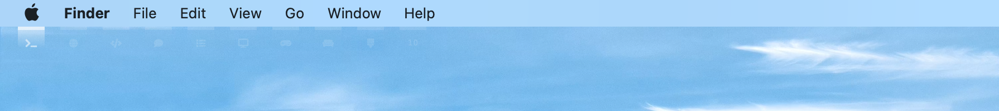
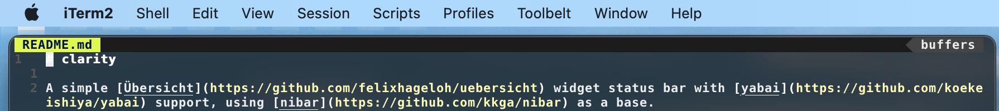
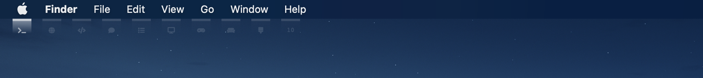
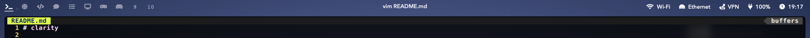

# Clarity
A fork of clarity with a simpler design fit for macOS

## Screenshots
### Clarity by rosenpin


### Clarity v2



This version is designed to blend with macOS Big Sur's new menu bar, with a workspace indicator that's visible when a padding of 8px is set on all sides of the screen using yabai.

### Clarity v1

This version is designed as a full width custom menu bar with workspace indicators, app title, and status bar items, while the built-in macOS menu bar is hidden. The height is approximately 20px, and is best used with an additional 8px padding set to all sides of the screen using yabai, in addition to padding for the top bar.

## Installation

Clone this repo to your Übersicht widgets directory.

```bash
$ git clone https://github.com/wernjie/clarity $HOME/Library/Application\ Support/Übersicht/widgets/clarity
```

If you prefer Clarity v1, switch to the `v1` branch. Then, refer to [the README for Clarity v1](https://github.com/wernjie/clarity/blob/v1/README.md) instead.
```
$ cd $HOME/Library/Application\ Support/Übersicht/widgets/clarity && git checkout v1
```

## Dependencies

- [Font Awesome 5 Free Solid](https://fontawesome.com/) — used for symbols in the statusbar widget

## Usage

### Yabai workspaces widgets

There is one widget for displaying workspaces with multi-display support.

### Refreshing yabai workspaces widget

The widgets for displaying yabai workspaces and window titles don't refresh automatically (to preserve battery). To refresh them, you can add these lines utilizing [yabai's signals](https://github.com/koekeishiya/yabai/wiki/Commands#automation-with-rules-and-signals) at the end of `.yabairc`:

```sh
yabai -m signal --add event=space_changed \
    action="osascript -e 'tell application id \"tracesof.Uebersicht\" to refresh widget id \"clarity-spaces-jsx\"'"
yabai -m signal --add event=display_changed \
    action="osascript -e 'tell application id \"tracesof.Uebersicht\" to refresh widget id \"clarity-spaces-jsx\"'"
```

### Caveats

- Your wallpaper should not be too busy or too bright, as this status bar has no background.


